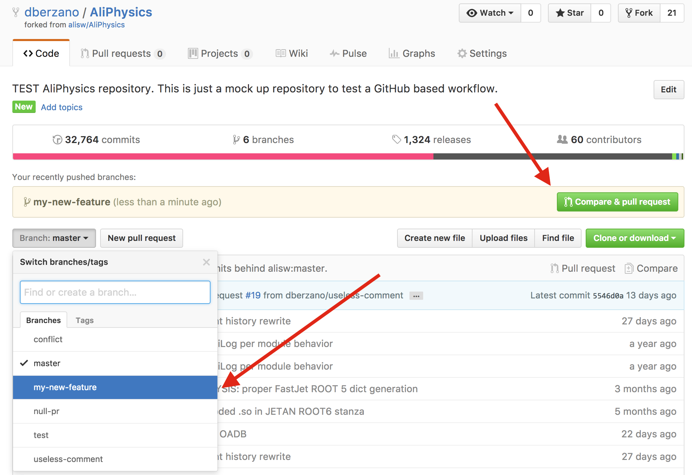
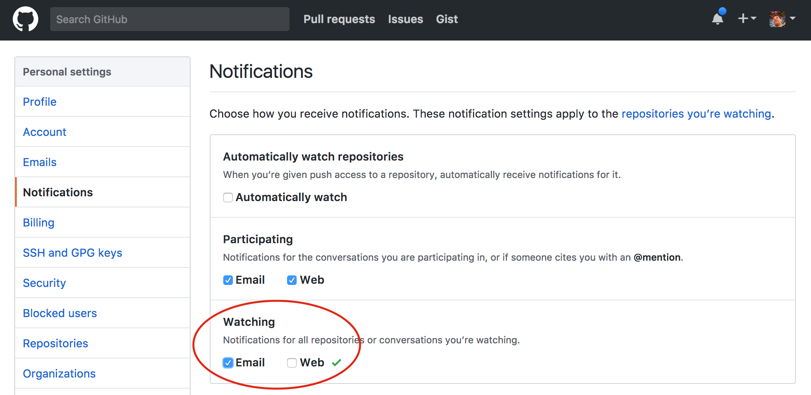
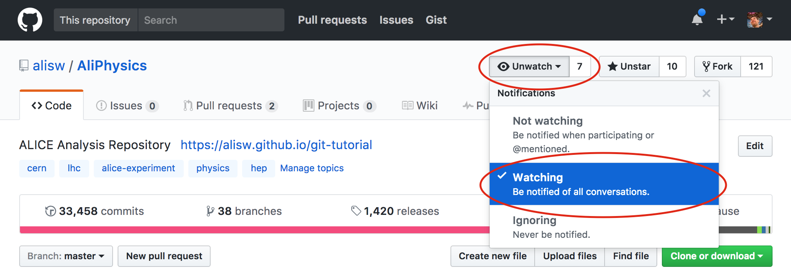

This guide is meant to be a set of advanced topics regarding the ALICE Github
workflow. If you are looking for a more step-by-step guide on how to get
started and propose code changes to AliPhysics, please start from the [basic
GitHub workflow](git-tutorial.md).


## I want to use the command line!

If you find the web based workflow not matching your taste, GitHub offers the
possibility to use a command-line based workflow as well via a utility called
`hub` .


### Install hub

On macOS you can install it with brew:

```bash
brew install hub
```

On Linux you can [use the precompiled
releases](https://github.com/github/hub/releases/). After you have installed
hub, the `hub` command will be available. Note that the [hub
documentation](https://hub.github.com/) suggests you configure `git` as an
alias to `hub` in your shell configuration:

```bash
alias git=hub
```

This way you can “extend” the `git` command functionalities with the ones
offered by `hub` seamlessly. We will not assume the alias is configured in this
document.

### Forking and cloning the repository

In order to fork a repository you can use `hub fork` and `hub clone`. The
following example clones the official AliPhysics repository and configures your
own fork (the `user.github` Git configuration parameter must be set as
suggested in the [basic workflow documentation](git-tutorial.md)). Note that your
fork is created on your GitHub account in case it does not exist:

```bash
cd ~/alice
hub clone alisw/AliPhysics
hub fork
```

### Creating a pull request

The second step to request your changes to be tested and reviewed in order to
be included upstream. This is done by typing:

```bash
hub pull-request
```

The command above allows you to do so without leaving the terminal. The output
of the command above will be a URL like:

```bash
https://github.com/alisw/AliPhysics/pull/12
```

If you copy-paste it to your browser you will see the GitHub interface for the
opened pull request, which is the same as if you had opened it via the web
interface.


## How to write a pull request

Try to be short (stay within 50 characters) and concise in the title, and save
any elaboration for the description.

A good example is:

- **Title:** Fix missing particles in the decay table
- **Description:** Warning messages about missing particle entries during the
  ppbench are fixed.

A bad example is:

- **Title:** A fix
- **Description:** <empty>

You should elaborate what the fix is for at least.

Another bad example is:

- **Title:** Fix missing particles in the decay table that caused ppbench to
  complain a lot with warning messages
- **Description:** <empty>

The title is too long, and most of what it says can be moved to the description
field.


## How to use large data files for analysis

Some large OADB files were removed from AliPhysics and they are no longer
available in the Git repository. Those files are not lost; they have been moved
to the following EOS location, which is accessible from lxplus:

```
/eos/experiment/alice/analysis-data
```

We have preserved the same directory structure found on AliPhysics, and the
same permissions: for instance, `PWGLF` is writable by all members of
`alice-svn-pwglf` (whose members can be edited by the group conveners).

Every day, in concomitance with the AliPhysics daily tag (at 4pm Geneva time),
this folder is snapshotted on CVMFS under the following path:

```
/cvmfs/alice.cern.ch/data/analysis/YYYY/vAN-YYYYMMDD
```

carrying the same name as the corresponding AliPhysics tag. Moreover, at
every AliRoot/AliPhysics production release, we also snapshot at:

```
/cvmfs/alice.cern.ch/data/prod/v5-XX-YY-01
```

where the last component is the AliPhysics tag name.

CVMFS brings the advantage to make data access from Grid jobs reliable and
faster due to caching (files unchanged in two different snapshots are not
downloaded twice).

In order to profit from the separate storage for large files we have created an
interface in AliRoot to allow transparent access to OADB files using a relative
path. For instance, if you want to access the following large OADB data file:

```
PWGLF/FORWARD/CORRECTIONS/data/fmd_corrections.root
```

you can do:

```cpp
TFile::Open(AliDataFile::GetFileNameOADB("PWGLF/FORWARD/CORRECTIONS/data/fmd_corrections.root"))
```

The static function `AliDataFile::GetFileNameOADB` returns the first accessible
full URL of the OADB file by finding the first match from the following ordered
list of paths:

1. `$OADB_PATH/<file>`
2. `$ALICE_DATA/OADB/<file>`
3. `$ALICE_PHYSICS/OADB/<file>`
4. `/cvmfs/alice.cern.ch/data/prod/v5-XX-YY-01/OADB/<file>` (for Grid jobs, or with CVMFS installed)
5. `/cvmfs/alice.cern.ch/data/analysis/YYYY/vAN-YYYYMMDD/OADB/<file>` (for Grid jobs, or with CVMFS installed)
6. `root://eospublic.cern.ch//eos/experiment/alice/analysis-data/OADB/<file>`

This means that for laptop analysis it will always be possible to access data
files, somehow, and in a transparent fashion. If you want to have your OADB
data locally, you can download it from lxplus:

```bash
export OADB_PATH=/path/to/my/local/oadb
rsync -av --delete cern_user@lxplus.cern.ch:/eos/experiment/alice/analysis-data/ $OADB_PATH/
```

> Trailing slashes are important to rsync! Do not forget them!

Note that the variable `$OADB_PATH` must be exported to the environment where
you run your local analysis in order to make it visible to the job.


### Non-OADB data files

The same EOS path has also PWG-specific directories, outside the OADB one, for
other analysis-specific data. The following interface can be used to access
files from there:

```cpp
TFile::Open(AliDataFile::GetFileName("PWGMM/my_large_data.root"))
```

> Note the difference between `GetFileName()` and `GetFileNameOADB()`.

In this case, the file will be searched in the following locations in order:

1. `$ALICE_DATA/<file>`
2. `$ALICE_PHYSICS/<file>`
3. `/cvmfs/alice.cern.ch/data/prod/v5-XX-YY-01/<file>` (for Grid jobs, or with CVMFS installed)
4. `/cvmfs/alice.cern.ch/data/analysis/YYYY/vAN-YYYYMMDD/<file>` (for Grid jobs, or with CVMFS installed)


## Git editors plugins

Many Git plugins exist in order to improve your Git workflow from within your
favorite editor. Examples of what you can do with such plugins are seeing what
parts of code were added or removed by you before committing them, or perform
the commit of some portions of your modifications.

* [Magit](https://magit.vc/) for Emacs
* GitGutter for [Sublime](https://github.com/jisaacks/GitGutter) or
  [Vim](https://github.com/airblade/vim-gitgutter)


## Work with multiple branches

The basic workflow we suggest is to use a single branch and develop one feature
at a time. If you follow this workflow then your local branch will be called
`master`, and so are called the remote working branch on your fork, and the
remote upstream branch.

You may want to develop multiple features at the same time because you do not
want to wait for one feature to be merged before proceeding, for instance.

To do so, the first thing to do is make sure your local `master` branch is
up-to-date:

```bash
cd ~/alice/AliPhysics
git checkout master
git pull --rebase upstream master
```

Now from your `master` branch, spawn a different one, and name it explicitly:

```bash
git checkout -b my-new-feature
```

The `git checkout -b` command creates the `my-new-feature` branch (the name is
arbitrary) and moves you to it. You can check at any time what is your current
branch at any time with:

```bash
git status
```

which will give you something like:

```text
On branch my-new-feature
nothing to commit, working directory clean
```

At this point you can start developing your code, and make your commits as usual
with `git commit`. When it comes the time for pushing, you need to tell Git that
you want to push your current branch to a remote branch with the same name (for
simplicity) on _your_ remote fork. This is done by:

```bash
git push --set-upstream origin my-new-feature
```

Note that all subsequent pushes from this branch can be simply done with:

```bash
git push
```

as you have already told Git what is the corresponding upstream branch once.

When you need to create a pull request you can simply do it from the command
line [in case you have Hub installed](#i-want-to-use-the-command-line):

```
hub pull-request
```

and it will return you the link (to copy and paste into your browser) to the
GitHub page corresponding to the newly created pull request. In case you want
to use the interface, go to your fork from a browser:

> https://github.com/\<your-github-username\>/AliPhysics

From the web interface you will see something like the following:



If you have recently pushed, which is the case most of the time, GitHub tells
you what is your branch name and proposes you to open the pull request right
away, as you can see from the yellow box. You just need to press the green
button indicated by the red arrow. This is very convenient.

In case you are not presented with a direct link, then use the dropdown to
select your branch explicitly (see the other red arrow). Once you have done
that just click the "New pull request" button next to the dropdown and continue
with the [normal workflow](git-tutorial.md#create-a-pull-request).

[As explained already](git-tutorial.md#amend-an-open-pull-request) in order to
amend or integrate an open pull request just keep committing and pushing on the
corresponding feature branch.

While you are working on a certain feature on a branch different from `master`
you can work on other features. You don't need to push your current changes,
and you don't need to open a pull request either: just _commit_ all your
changes with, for instance:

```bash
git add --all -v :/
git commit
```

in order to be able to cleanly switch to a different branch (if you don't want
to commit you can use the [stash](https://git-scm.com/docs/git-stash) too).

Now switch back to `master`, update it, and create a new branch from there:

```bash
git checkout master
git pull --rebase upstream master
git checkout -b my-second-feature
```

You can now follow the same workflow, by keeping in mind that you can switch
back and forth using `git checkout` (without the `-b` option this time).

> It is important you create your feature branches from an updated `master`,
> and not from other feature branches, in order to avoid confusion and in order
> to avoid opening different pull requests with overlapping contents.

The advantage of this workflow is that you will never work in your `master`
branch (_i.e._ you will never perform `git push` from there): your changes and
the upstream ones are clearly separated.


### Clean up feature branches

Once your pull requests get merged, you can delete both your local feature branch
and the remote counterpart. Note that this is completely optional.

To delete your local branch, first move to the `master` and update it:

```bash
git checkout master
git pull --rebase upstream master
```

then delete it:

```bash
git branch -d my-feature-branch
```

If your branch was merged to `master` then Git will not complain. If your
branch was not merged, Git will prevent you from accidentally delete it (you
can force by using `-D` instead of `-d` if you really know what you are doing).

Now you can delete the remote one **(this is a dangerous and irreversible
operation)**:

```bash
git push origin :my-feature-branch
```

It's the `:` that does the trick (it's not a typo).


## Port unpushed old commits to GitHub

In case you have local Git commits you did not push in your old AliPhysics
repository and you would like to push them to GitHub now, you can create a
"patch" from your old local repository and apply it on top of your local GitHub
copy of AliPhysics.

Go in your old AliPhysics repository (assumed to be in `~/alice-old`):

```bash
cd ~/alice-old/AliPhysics
git format-patch HEAD^1
```

The `HEAD^1` means: take the first commit on top. If you have more than one
commit to port, replace `1` with the appropriate number.

You will find in your current directory a number of `.patches` files. If you
have your new AliPhysics directory under `~/alice`, you can go there and apply
all of them at once, after making sure you have all the upstream changes
locally:

```bash
cd ~/alice
git checkout master
git pull --rebase upstream master
git am ~/alice-old/AliPhysics/*.patch
```

Note that this command assumes that the only `.patches` files you have in your
old AliPhysics directory are the ones you have just created with `git
format-patch`.

At this point you can push to your local fork and create a pull request:

```bash
git push origin
hub pull-request -b alisw/AliPhysics:master
```

The `hub` command works if you have the command line tool installed, otherwise
just follow the web-based procedure.


## Rebuild an old AliRoot/AliPhysics release

GitHub clones are only valid for building AliRoot/AliPhysics releases from
v5-09 on. Due to the repository cleanup, checking out an older version will
lead to inconsistent results.

Suppose you want to build version v5-08-18 of AliRoot (corresponding to
v5-08-18-01 of AliPhysics). In a separate directory, called `~/alice-legacy`,
you can do:

```bash
mkdir ~/alice-legacy && cd ~/alice-legacy
aliBuild --dist IB/v5-08/prod init AliRoot,AliPhysics
```

Then you can explicitly checkout the versions you need:

```bash
cd ~/alice-legacy/AliRoot
git checkout v5-08-18
cd ~/alice-legacy/AliPhysics
git checkout v5-08-18-01
```

Now you can run aliBuild as usual:

```
cd ~/alice-legacy
aliBuild build AliPhysics
```

The trick is using the recipes set (alidist) from the branch `IB/v5-08/prod`,
which has the correct pointers to the frozen old clones of AliRoot and
AliPhysics.


## Use the reference OCDB

Our production OCDB is stored on CVMFS and AliEn, however we also have a
reference OCDB which used to be part of AliRoot. The reference OCDB is no
longer there: it can now be found at this [separate Git
repository](https://gitlab.cern.ch/alisw/AliRootOCDB/).

To use the new OCDB with AliPhysics, you first need to build the package:

```bash
cd ~/alice
aliBuild build AliPhysics
aliBuild build AliRoot-OCDB
```

When you enter the environment, load it as extra package:

```bash
cd ~/alice
alienv enter AliPhysics/latest AliRoot-OCDB/latest
```

The OCDB will be available at the following path:

```
$ALIROOT_OCDB_ROOT/OCDB
```

so you will need to update your paths accordingly. If you don't use aliBuild
you can simply clone the package and manually export the environment variable:

```bash
cd ~/alice
git clone --origin upstream https://gitlab.cern.ch/alisw/AliRootOCDB.git
export ALIROOT_OCDB_ROOT=$PWD/AliRootOCDB
```

> Note that `ALIROOT_OCDB_ROOT` is the toplevel directory containing in turn
> the `OCDB` directory with the calibration files.


## Setup a Git credentials cache

While compiling the AliRoot/AliPhysics software chain you might be asked
several times to input your CERN username and your password. This is because
some of the required software components have licensing restrictions and cannot
be made publicly available, so authentication is an inevitable consequence. This
happens for instance with the DPMJET generator.

To prevent automated installations from bothering you with multiple password
requests, you can set up a Git credentials cache.

You can do (only once):

```bash
git config --global credential.helper "cache --timeout=86400"
```

to tell Git to save in memory all inputted credentials for one day. You will be
prompted for your password only once in 24 hours, or if your password changes
and the cached one is no longer valid.

The cache duration can be configured with the `--timeout` switch and it is is
expressed in seconds.

A very unsafe option is to _permanently_ store your password in
`~/.git-credentials`: you will be prompted only once, and the password will be
forever stored there **in clear text**.

```bash
git config --global credential.helper store
```

> Note: this solution is not good for your laptop. It is meant to target
> clusters with unattended installation systems.

If you are on macOS you can also save your Git password inside your Keychain:

```bash
git config --global credential.helper osxkeychain
```

More information on caching Git credentials can be found [on the GitHub
documentation](https://help.github.com/articles/caching-your-github-password-in-git/):
the documentation applies also to repositories not hosted on GitHub.


## Get notified for all changes

Email notifications are handled by GitHub and will be sent to the email you
have linked to your GitHub account.

If you want to be notified for every activity on a certain repository, you
first need to make sure "watch" notifications are enabled. Go to the [GitHub
notification settings](https://github.com/settings/notifications) page for your
account, and enable email notifications for **Watching**:



A green tick will appear next to the checkboxes to confirm your settings have
been saved (there is no "save settings" button).

Note that in the [GitHub notification
settings](https://github.com/settings/notifications) you can granularily
specify what are the events that trigger a notification. You can for instance
be notified only for pushes or merges, and not for every comment.

> Note that independently from your "Watch" settings, you will continue
> receiving emails if you are **@mentioned** if the **Participating** settings
> are ticked.

Navigate now to the repository you want to follow, for instance
[AliPhysics](https://github.com/alisw/AliPhysics) and on the dropdown on top
select **Watch** to be notified of all activities.


