## What are these instructions for?

These instructions are meant to be the simplest way to get you up and running
developing one feature at the time for AliPhysics on GitHub. They can be reused
for AliRoot by simply changing AliPhysics to AliRoot. If you are trying to do
something more complicated or you want to have more detailed information on the
inner workings of the system, please refer to the [advanced
workflow](git-advanced.md) instead.


## Setup GitHub account

The first thing you need to do is to create an account there and to map your
CERN account to a GitHub one. This is a one time operation. You can do the
mapping by going to:

> <https://alisw.cern.ch/alice-github/login>

In case you don’t have a GitHub account you will be asked to create one. Notice
there is no need for a paying account: a free GitHub account is sufficient to
work on ALICE software.

> **Note:** we recommend you create a GitHub username which is the same as your
> CERN one, if available.

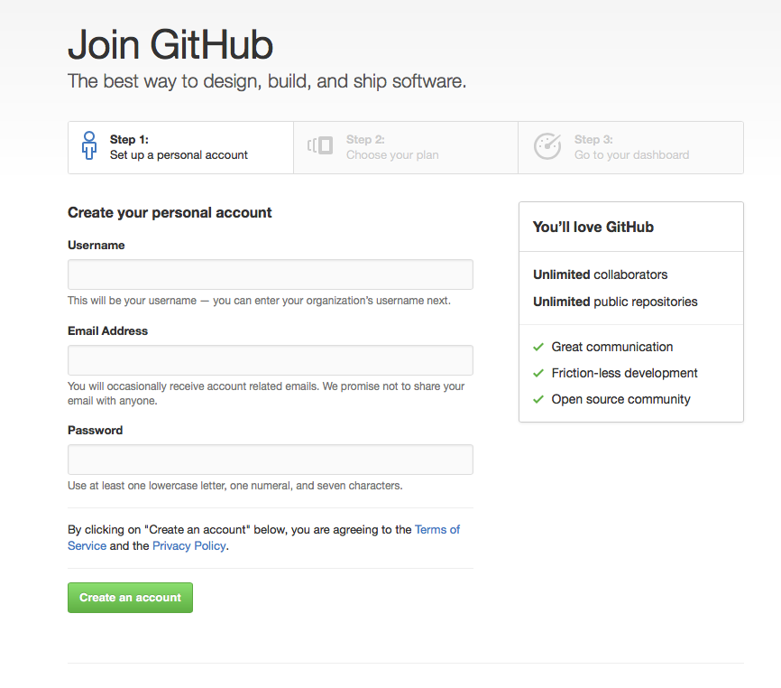

In case you have an account, login and authorize “ALICE Continuous Integration”
to read your user name so that it can be mapped to your CERN account.

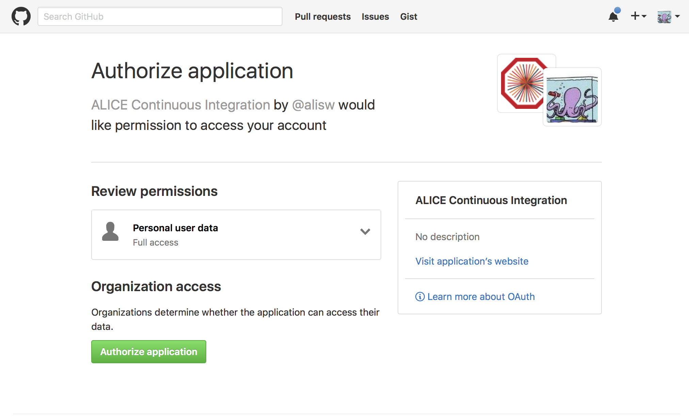


## Fork a repository

“Forking” a repository in GitHub means that you create a remote copy of some
official (*i.e.* *upstream*) repository in your own account. This copy is
linked to the original repository and allows you to propose changes in the form
of a so-called “Pull Request”.

To fork AliPhysics you can point your browser to:

> <https://github.com/alisw/AliPhysics/fork>

and follow the instructions.


## Setup user configuration on your local computer

Initial setup:

```bash
git config --global user.name "<Firstname> <Lastname>"
git config --global user.email <your-email-address>
git config --global user.github <your-github-username>
```

Note that the `--global` flag sets those parameters for every Git repository on
your laptop. Depending on the number of Git projects you contribute to you might
want to set such options per repository.

> The `user.name` will appear in every commit you make. Note that the old
> configuration suggested you used your CERN account name, whereas we now
> suggest you configure it with your “Firstname Lastname”.

It is probably convenient to setup a passwordless login for GitHub using SSH,
otherwise you need to type your password on each operation. If you already have
a SSH key [have a look at these
instructions](https://help.github.com/articles/adding-a-new-ssh-key-to-your-github-account/).
More details on GitHub and SSH are [also
available](https://help.github.com/articles/connecting-to-github-with-ssh/).


### Credentials for private repositories

A full AliRoot/AliPhysics build requires manually inputting your CERN username
and password in some cases, as it is stored on private ALICE Git repositories
hosted at CERN GitLab.

In order to access them, you need to **login to
[gitlab.cern.ch](https://gitlab.cern.ch/) at least once using your browser** in
order to be registered, otherwise you will not be able to download private
components! After you have done that for the first time you need to wait for up
to one hour before you can download the code. This is explained on [this CERN
IT-maintained
documentation](https://cern.service-now.com/service-portal/article.do?n=KB0003137).

During the compilation process you might be asked several times for your CERN
credentials. To avoid repeating the procedure several times, and to prevent
unattended builds to wait for your input, you can [setup a temporary or
permanent credentials cache](git-advanced.md/#setup-a-git-credentials-cache).
Note that the credentials cache is also an alternative to setting up a GitHub
SSH key.


## Setup software repositories on your local computer

We recommend to follow the [ALICE Analysis Tutorial](https://alice-doc.github.io/alice-analysis-tutorial/building/).
Alternatively, see further below if you want to check out the repository manually.

> With older versions of aliBuild, the central remote repository (used for
> pulling updates) would be called `origin` instead of the usual name `upstream`
> and the personal (fork) remote repository (used for pushing changes) would be
> called `<your-github-username>` instead of the usual name `origin`.
> Please check your settings using `git remote -v` and adjust the Git commands
> mentioned in the following instructions accordingly, if needed.

We will assume from now on that your working directory is `~/alice`. If you
have your old installation under `~/alice` then we suggest you use a different
directory to avoid confusion.


### I have participated to the GitHub test

If you have participated to the GitHub test and you want to sync with the
current official AliRoot/AliPhysics and alidist repositories from upstream,
you can now follow this procedure which might save you some build time.

Assuming you have your GitHub test installation under `~/alice`, destroy your
current recipes, AliRoot and AliPhysics directories:

```bash
cd ~/alice
rm -rf alidist/ AliRoot/ AliPhysics/
```

Then clone AliRoot and AliPhysics from GitHub:

```bash
cd ~/alice
git clone --origin upstream https://github.com/alisw/AliRoot
git clone --origin upstream https://github.com/alisw/AliPhysics
```

If you use aliBuild you can skip the two clones and do directly:

```bash
cd ~/alice
aliBuild init AliRoot,AliPhysics
```

You may now [setup your repositories](#contribute-to-alice-software) and
[update your fork with changes from the
master](#updating-your-fork-with-changes-from-the-master), and you will be
ready to build, and create pull requests.


### Contribute to ALICE software

Now if you want to contribute to AliPhysics move to the clone directory and
tell Git about the existence of your own fork, created in a previous step.

If you use SSH (recommended, especially if you are using a slow or unreliable
connection):

```bash
cd ~/alice/AliPhysics
git remote add origin git@github.com:<your-github-username>/AliPhysics.git
```

If you do not use SSH:

```bash
cd ~/alice/AliPhysics
git remote add origin https://github.com/<your-github-username>/AliPhysics
```


## Updating your fork with changes from the master

While you are working, other people may propose code for inclusion in the
master. You can update your local repository and your fork with the latest
version of the master with the following lines:

```bash
cd ~/alice/AliPhysics
git pull --rebase upstream master
git push origin
```

> Note that if you are in the middle of your work (_i.e._ you have your changes
> already pushed to your forked repository which are not yet merged), you might
> need to perform a “force push”, as the `--rebase` option may change your local
> Git history:
>
> ```bash
> git push -f origin
> ```
>
> You should use the `-f` switch **only when needed and if you are sure you are
> not going to destroy any of your changes first**.

Note that you don’t need to pull from upstream every time you need to push your
changes. This is a big improvement over the old workflow where you had to pull
before you could push, which could happen frequently when the daily tag time
approached.


## Workflow to commit your changes

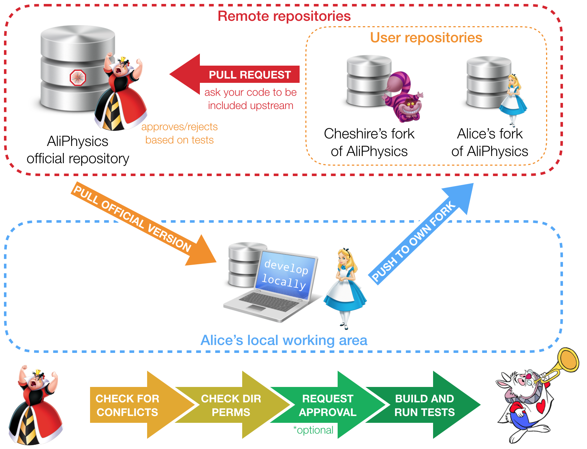

As depicted in the image, the general idea is:

* you always fetch the changes (“pull”) from the upstream repository
* you always write your changes (“push”) to your own fork
* you propose the changes to be added upstream by opening a “pull request”
* your code change proposal is checked by a series of automatic tests before
  being accepted (more details follow)

What we illustrate here is a simplified workflow, where you work on a single
branch. The workflow is simpler, but it has limitations you need to know.

* **If you work on one feature at a time** this is enough. When you open the
  pull request, though, you will have to _wait until it is accepted and merged_
  before starting developing new features. This is because each pull request is
  tied to your remote `master`, and if you push to it you are updating the
  _existing_ pull request. For the same reason, if you follow this workflow _you
  cannot open multiple pull requests at the same time_ because you need multiple
  branches for that.
* **If you need to work on multiple features at the same time** then you will
  need to work with [multiple branches (advanced
  documentation)](git-advanced.md#work-with-multiple-branches).

> It is important to stress that if you have an open (not yet merged) pull
> request following this simplified workflow and you push new changes, then
> **the open pull request gets updated and tests will start over!**


## Create a pull request

Let’s say you have a development to AliPhysics you want to propose for
inclusion. This is done with a “pull request”. In order to create one you need
to do the following. First off, commit the changed files and push them to your
fork:

```bash
cd ~/alice/AliPhysics
git add <file>  # possibly several times
git commit
git push origin
```

At this point changes are on your own fork on GitHub, and **they are not yet
upstream**. This means they will ***not*** be included in the daily tag, for
the moment. It is important to understand this point as this is the main
difference to the old workflow. To get your changes included, you need to
create a pull request by going to:

> https://github.com/\<your-github-username\>/AliPhysics

then click on “New pull request”:

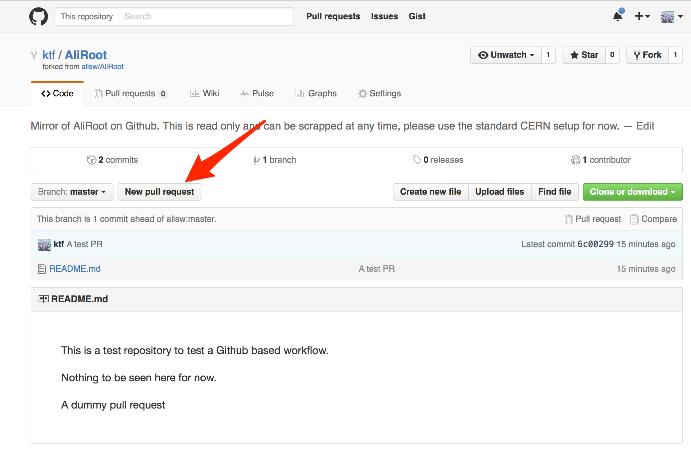

Review the proposed changes and if you are satisfied click on the green button
saying “Create a pull request”:

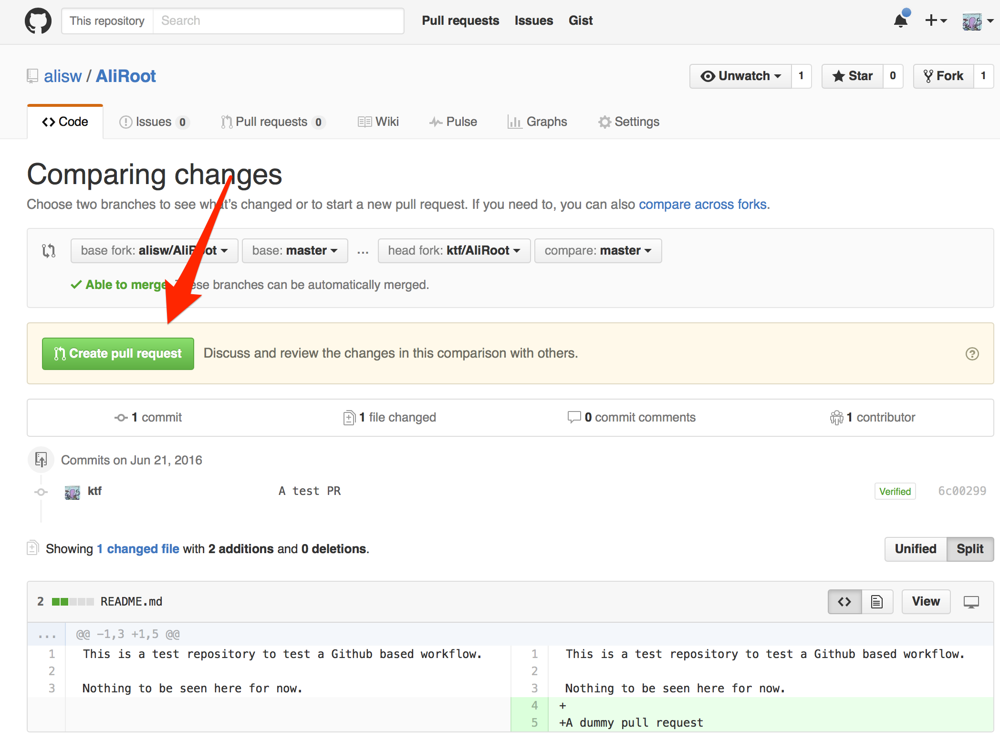

Please make sure the title and the description of your pull request are
spell-checked and express the purpose of the changes in a simple and concise
way. A good description will help yourself, the other contributors to ALICE
software, and it will guarantee a faster approval (if required).

> Notice GitHub is a popular, public, hosting site, so there will be zero
> tolerance for offending statements or embarrassments to ALICE collaboration.
> In case of doubt, you can find more information in the [commit
> guidelines](git-advanced.md#how-to-write-a-pull-request).

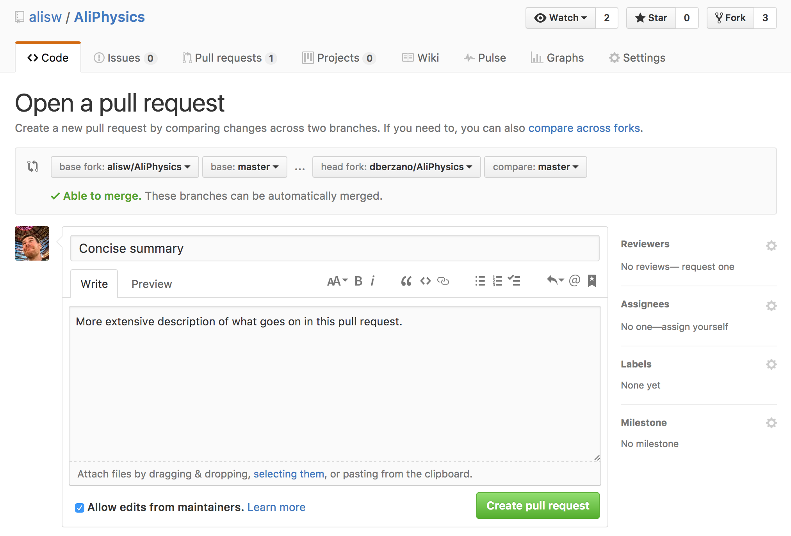

Once you are done, your code is **proposed** for inclusion in the official
repository, but it’s not yet in, as it needs to pass a review process. Notice
also that creating pull requests can be done from the command-line, see the
[advanced guide](git-advanced.md#i-want-to-use-the-command-line) for more
information.


## Review process

Pull requests are checked for permissions first, and permissions are
directory-based (or in some cases even file-based). We have retained the old
permissions, so if you were not previously supposed to modify files under a
certain directory, this process now requires an approval.

There might be two possible scenarios:

- The user is **allowed** to modify all files affected by the pull request.
- The user is **not allowed** to modify all files and there is a list of
  “approvers” who must approve it first.

In the first case, the user is allowed to modify the files and the build system
will tell you that by commenting. For example:

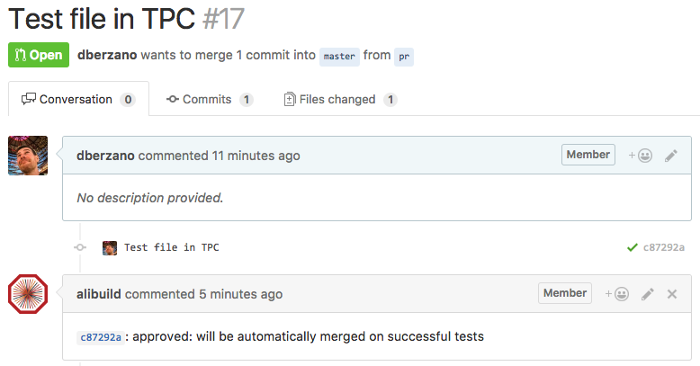

In the other case, if the user is not allowed to modify the code touched by the
pull requests, the person(s) responsible will be contacted automatically and
will be asked to comment on the pull request and whether or not the change is
approved. In this example, Jan Fiete and Jochen need to approve the request:


Note that the system will add the real name next to the GitHub username. GitHub
users are mentioned by prepending `@` to the username in a comment: by default,
mentioned users will receive an email notification. This is how approvers get
notified of pending commits.

People with approval rights have now to comment by posting one of the following
special comments:


- `+1`: **approve the change.** If tests are successful the pull request
  will be automatically merged.
- `+test` **approve testing only.** Tests will be started but pull request
  won’t be automatically merged even if tests are all green. Green tests will
  require a further approval.

> Note that the `+1` or `+test` must be the first word of your comment,
> otherwise the comment will be ignored. The automatic review system will
> provide feedback after your reply. Obviously, `+1`s from unauthorized users
> are simply ignored.

Once all approvals have been granted, testing begins. The automatic system will
give you a feedback similar to the following:


No pull request is automatically rejected. In case a pull request wants to
change the project structure it will be handled by the project administrators.


## Testing process

Every single pull request is tested for a successful build on our production
environment: this means that a pull request in AliPhysics should work with the
reference AliRoot version using the same environment used on the Grid.

The automatic build system provides you feedback through the GitHub testing
interface. In case you see a yellow badge, it means that the system has taken
over your request and it is now trying to build it:

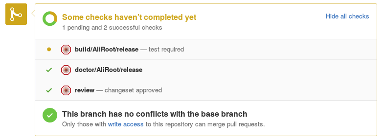

If your code produces an error, this is reported together with the problem. For
instance:

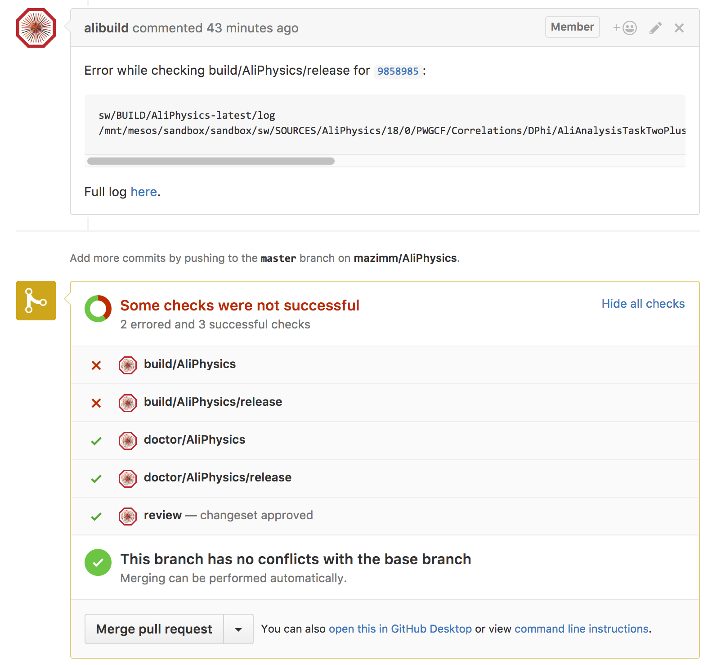

Part of the build log is reported in the comment. The full log is also
available by clicking on the “Full log” link.

In this case, you need to fix the problem and push the fix to your fork (the
same way as before). The new commits are then automatically added to the pull
request, and testing is restarted. If you don’t want to add a commit but you
simply want to change your previous one have a look at the [amend
howto](#amend-an-open-pull-request) below.

If your code works fine, this will be reported:


Your code will be merged into the master and the pull request closed:


This may be a good moment to [update your repository with the latest changes in
the master](#updating-your-fork-with-changes-from-the-master).


### Pull request size limit

We have put in place a size check on each opened pull request set to 20 MB. The
limit is in place in order to avoid an uncontrolled growth of the Git
repositories and make them slimmer and easier to download.

In case you go beyond the limit, your pull request will be automatically
rejected:


You will also receive an email notification. The general idea is to use the
code repositories to store code only: since sometimes there is the need to store
data files too [we are providing an
alternative](git-advanced.md#how-to-use-large-data-files-for-analysis) with the
following features:

* Large files are easy to upload and with proper PWG-based permissions
* Large files are versioned daily on CVMFS for easy access from Grid jobs
* We have an interface in AliRoot to access those files transparently

If you are using or plan to use large files, even if you are below our current
limit, [we encourage you to follow the documented
procedure](git-advanced.md/#how-to-use-large-data-files-for-analysis).


## Conflicts between different pull requests

Sometimes it might happen that your pull request touches files modified also by
other users, thus creating a “conflict”. Conflicts cannot be solved
automatically: a human is needed to sort them out.

Conflicts with pull requests can occur at any time.

- **As soon as you open a pull request.** This means that probably your code
  did not have all the upstream changes when you have opened the pull request.
- **After you have opened a pull request (even if tests were in progress
  already!)** This means that, while your pull request was being tested,
  another one with incompatible changes got merged upstream.

In both cases you will receive a notification in the form of a comment (which by
default triggers an automatic email). For instance:

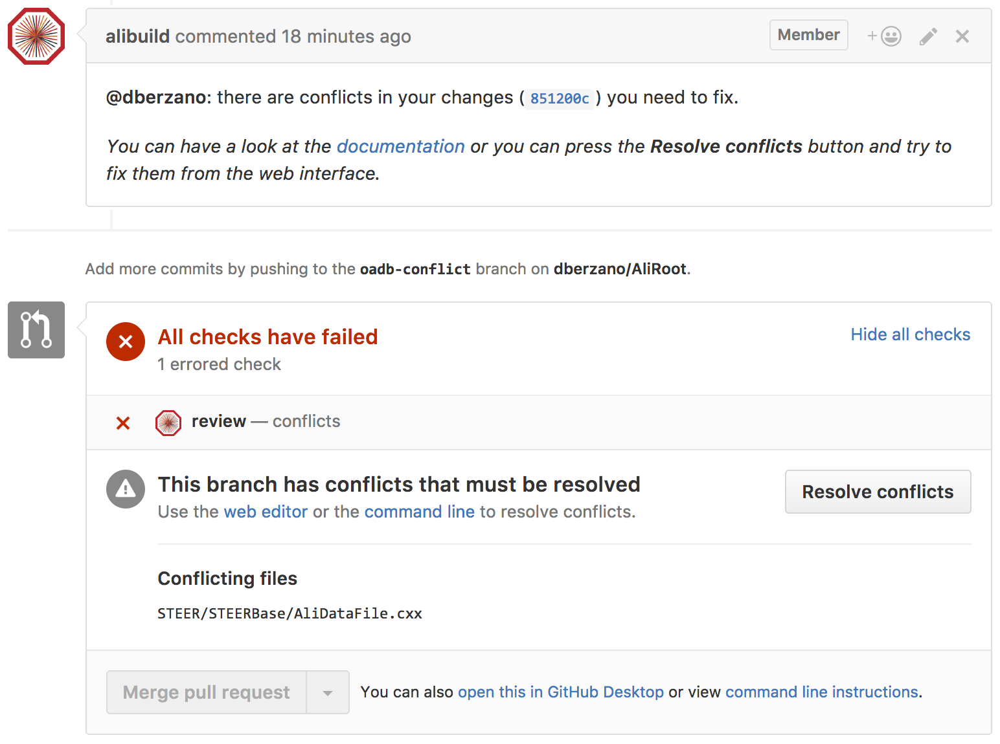

The GitHub interface suggests you to use the “web editor” or the “command line”
to resolve conflicts, and presents you with sensible suggestions. The web
editor option is very convenient when conflicts are trivial (*i.e.* you have
set `myPtCut = 12345` and your fellow colleague has set it to `myPtCut =
98765`: contact her to know who is right and fix the cut accordingly). To start
the web assisted merging, click on “resolve conflicts”.  The following window
shows you the conflicts one by one.

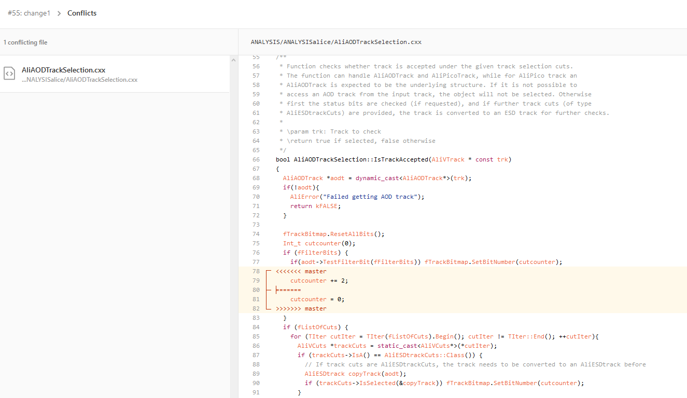

For each conflict you find the following snippets:

```diff
<<<<<<<<< master
  // code that is already in the master
=========
  // your code (of the current pull request)
>>>>>>>>>
```

The code above is the existing code. The one below your change. Freely edit in
the window until you think the conflict is resolved. Now you can save your
changes by clicking “mark as resolved”.


Once all files have been processed, click on “commit changes”:

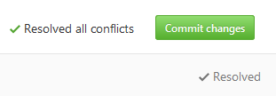

The changes are saved as a new commit to your fork and automatically added to
the pull request. Now the review and testing process starts from the beginning.

For more complex conflict resolutions, or if you are uncomfortable with web
interfaces, there is an extended tutorial [here](https://www.atlassian.com/git/tutorials/using-branches/merge-conflicts).


## Amend an open pull request

In case the pull request is not approved or automatic tests do not pass, you
should take the necessary measures to amend it. This is done by simply making
changes to your local repository, commit them and push them: new commits will
be automatically appended to the already opened pull request, and tests will be
restarted.

If you have a single broken commit with your changes and you want to change it
(as opposed to adding a new commit with the fixes) you can commit with the
command:

```bash
git commit --amend
```

This will require a `git push -f origin` afterwards. If you
don’t force-push it won’t go through.


## Discard pull request including changes made in your fork

In case you want to retire your pull request by throwing away your changes and
resume your work from upstream you need to “reset” the state of your working
copy to the upstream repository:

```bash
cd ~/alice/AliPhysics
git branch my-backup-just-in-case  # create a branch backupping your state
git fetch --all
git reset --hard upstream/master
git push -f origin
```

Now, you have aligned your current branch with the upstream changes, and your
former work was backupped just in case, in the `my-backup-just-in-case` branch
(of course the name is arbitrary). The backup part is optional.

> Note that doing so without a backup will imply **a loss of your current
> work**. You must really be sure that you want to discard it first. If you
> want to work on multiple features at the same time, and have different pull
> requests open at once, please refer to the [advanced guide](git-advanced.md).


### Restore work from a backupped branch

If at some point you wish to resume your work from a previously abandoned branch
(whose name we assume is `my-backup-just-in-case`), you can do from your
master branch:

```bash
cd ~/alice/AliPhysics
git pull --rebase upstream master
git pull --rebase . my-backup-just-in-case
```

With the double `git pull` you are getting the new changes from upstream, and
you are importing in your current branch your previously backed up work.
