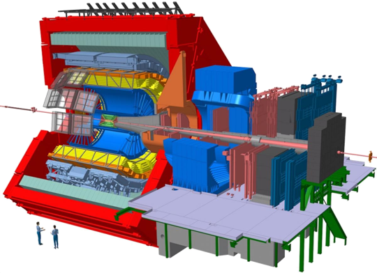

The ALICE Collaboration has built a dedicated detector to exploit the
unique physics potential of nucleus-nucleus collisions at LHC energies.
Our aim is to study the physics of strongly interacting matter at
the highest energy densities reached so far in the laboratory. In
such condition, an extreme phase of matter - called the quark-gluon
plasma - is formed. Our universe is thought to have been in such a
primordial state for the first few millionths of a second after the Big
Bang. The properties of such a phase are key issues for Quantum Chromo
Dynamics, the understanding of confinement-deconfinement and chiral
phase transitions. For this purpose, we are carrying out a comprehensive
study of the hadrons, electrons, muons and photons produced in the
collisions of heavy nuclei. ALICE is also studying proton-proton and
proton-nucleus collisions both as a comparison with nucleus-nucleus
collisions and in their own right. This page hosts the software for RUN1 and RUN2 of the experiment, AliRoot
(ALICE Offline Framework) and AliPhysics (ALICE Analysis repository).

You can find a basic tutorial on how to use the software
[here](git-tutorial.md), and an advanced tutorial [here](git-advanced.md).
