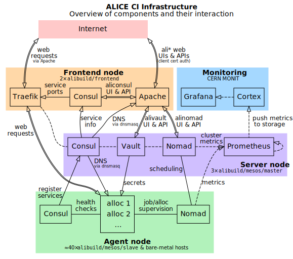

## Cluster architecture description

The ALICE build infrastructure consists of two kinds of nodes: masters, responsible for scheduling jobs, and agents, responsible for executing jobs and services.
They are in general provisioned using [CERN Openstack Infrastructure](https://openstack.cern.ch) and configured using the [CERN Puppet / Foreman setup](https://cern.ch/config).

Masters belong to the Puppet hostgroup `alibuild/mesos/master` while agents belong to `alibuild/mesos/slave`.
The configuration of those hostgroups can be found in the `master` branch of the [it-puppet-hostgroup-alibuild](https://gitlab.cern.ch/ai/it-puppet-hostgroup-alibuild) git repository, in particular in:

- [/code/manifests/mesos/master.pp](https://gitlab.cern.ch/ai/it-puppet-hostgroup-alibuild/-/blob/master/code/manifests/mesos/master.pp) for the master.
- [/code/manifests/mesos/slave.pp](https://gitlab.cern.ch/ai/it-puppet-hostgroup-alibuild/-/blob/master/code/manifests/mesos/slave.pp) for the slaves.

In order to be able to modify this configuration, and to create or deploy machines in those hostgroups, you will have to be part of the `alice-puppet` and `alice-agile-admin` hostgroups.

We have in particular three masters, each running on a separate OpenStack availability zone.
These work in a High Availability (HA) mode, which allows the ensemble to continue working correctly, even in the eventuality that one of the machines goes down.
A diagram for the services running on the masters can be found below:

<!-- Note: run `dot -Tsvg -oimages/nomad-infra.svg images/nomad-infra.dot` to regenerate this plot. -->
[](images/nomad-infra.svg)

The masters run the following services:

- The [**Nomad server**](https://nomadproject.io/):
  Nomad is used to schedule and deploy jobs like CI builders and publishers automatically on the cluster.

- The [**Consul server**](https://consul.io/):
  A key-value store, used for its DNS features (Nomad jobs are assigned `<job name>.service.consul` domain names), and used as a backing store for Vault.

- The [**Vault server**](https://vaultproject.io/):
  This service stores secrets and lets Nomad jobs use them, by substituting them into job declarations on-the-fly.

- [**Prometheus**](https://prometheus.io/):
  A monitoring service that polls various running jobs, in addition to the Nomad, Consul and Vault servers, and sends metrics to MONIT Cortex.
  [This integration is documented here.](https://monit-docs.web.cern.ch/metrics/prometheus/)

## Essential Operation Guides

* [Getting access to the OpenStack / Puppet infrastructure](#getting-access-to-the-openstack-puppet-infrastructure)
* [Creating a master](#creating-a-master)
* [Backup the masters](#backup-master)
* [Rebuild a master](#rebuilding-a-master)
* [Creating an agent](#creating-an-agent)
* [Reboot an agent](#rebooting-a-server)
* [Delete an agent](#deleting-a-build-infrastructure-vm)

### Getting access to the OpenStack / Puppet infrastructure

First of all make sure you have all the rights to create machines in OpenStack and to administer them via Puppet. 

To get the OpenStack access rights, you should ask to become member of the `alice-vm-admin` egroup. To get the Puppet rights, you should ask to become member of the `alice-agile-admin` egroup. This can be done using the usual [egroups interface](https://egroups.cern.ch).

Once you have those rights to use OpenStack, you need to ssh into the CERN OpenStack administration machines (`aiadm.cern.ch`) and obtain the correct OpenStack credentials for the virtual machines by running:

```bash
eval $(ai-rc "ALICE Release Testing")
```

or, for the physical machines managed by CERN IT:

```bash
eval $(ai-rc "ALICE Release Testing - physical nodes")
```

You can now execute the various OpenStack commands, using the CLI tool called `openstack`.
While an exhaustive list of all the available options can be optained via `openstack help -h`, for the process of spawning new machines you probably only care about:

- `openstack server list`: list the machines in the project you specified on the `eval $(ai-rc ...)` line above
- `openstack image list`: list of OS images you can use. The build nodes should use the latest "Alma 9" ones.
- `openstack flavor list`: list available flavors of virtual machines (i.e. how many CPUs, RAM).

Further information on how CERN OpenStack cloud works can be found [here](https://clouddocs.web.cern.ch/).

Note that you will have to login as `root` to all the machines.

### Checklist to verify the status of a master

In case there are issues with one of the masters you should follow the following checklist:

* Check on the [Openstack Dashboard](https://openstack.cern.ch) if the machine is up and running.
* Check in [Foreman](https://foreman.cern.ch) if there are any puppet errors.
* Ping the machine.
* SSH into the machine.
* Check if docker.service, nomad.service, consul.service and vault.service are running.

### Creating a master

Creation of masters in CERN Foreman setup is described in the [Configuration Management User Guide](https://configdocs.web.cern.ch/nodes/create/index.html).
The short recipe for a build machine is:

- Login to `aiadm.cern.ch`.
- Set up your OpenStack environment by doing:

  ```bash
  eval $(ai-rc "ALICE Release Testing")
  ```
- To spawn a machine you need to use the `ai-bs` wrapper, which will take
  care of provisioning the machine and putting it in Foreman, so that it will
  receive from it the Puppet configuration:

  ```bash
  MACHINE_NAME=<alimesosXX>
  ZONE=cern-geneva-<X> # <X> needs to be in {a,b,c}
                       # make sure you use different zones
                       # to improve availability.

  ai-bs -g alibuild/mesos/master               \
        --foreman-environment alibuild_devel   \
        --alma9                                \
        --nova-sshkey alibuild                 \
        --nova-availabilityzone $ZONE          \
        --nova-flavor m2.large                 \
        --landb-mainuser alice-agile-admin     \
        --landb-responsible alice-agile-admin  \
        $MACHINE_NAME
  ```

### Backup master

Backing up of the masters is done for the `/build/consul` folder via the [standard backup service of CERN/IT](https://information-technology.web.cern.ch/services/Backup-Restore-Service).
The service itself is setup via puppet as usual.
Things which can resuscitate a backup when it fails:

```bash
# restarting the service
service dsmcad restart
# Asking for an incremental backup
dsmc incremental
```

### Creating an agent

Creation of mesos agents in CERN Foreman setup is described in the [Configuration Management User Guide](https://configdocs.web.cern.ch/nodes/create/index.html).
The short recipe for a build machine is:

- Login to `aiadm.cern.ch`.
- Set up your OpenStack environment by doing (for build machines):

  ```bash
  eval $(ai-rc "ALICE Release Testing")
  ```

  or, for the physical/bare-metal machines:

  ```bash
  eval $(ai-rc "ALICE Release Testing - physical nodes")
  ```

- In order to create new machines, you will also need the public SSH key to be
  added on the `alibuild` machines. Execute (assuming you have saved the public
  SSH key in `alibuild.pub`):

  ```bash
  openstack keypair create --public-key alibuild.pub alibuild
  ```

  This only needs to be done the first time you create a VM.

- Specify a few parameters for the machine you want to spawn:

  ```bash
  MACHINE_NAME=<alibuildXX/alimetalXX>
  FLAVOR=<OpenStack flavor name, see below>
  VOLSIZE=<"1000GB" for VMs, empty for physical machines>
  ```

  For virtual machines, `FLAVOR` is `m2.2xlarge`. For physical/bare-metal
  machines, this will be a string given by CERN IT, probably of the form
  `p1.dlXXXXXXX.S513-V-IPXX`. You can list the flavors you have access to by
  running `openstack flavor list`.

- To spawn a machine you need to use the `ai-bs` wrapper, which will take
  care of provisioning the machine and putting it in Foreman, so that it will
  receive from it the Puppet configuration:

  ```bash
  ai-bs -g alibuild/mesos/slave --alma9                              \
        --foreman-environment production                             \
        --nova-sshkey alibuild --nova-flavor "$FLAVOR"               \
        --landb-mainuser alice-agile-admin                           \
        --landb-responsible alice-agile-admin                        \
        ${VOLSIZE:+--nova-attach-new-volume "vdb=$VOLSIZE:type=io1"} \
        "$MACHINE_NAME"
  ```

  This will spawn a new machine. You can check the boot status either in the
  OpenStack GUI or via `openstack server show -f yaml "$MACHINE_NAME"`. Of
  course you should change the name of the machine (`<alibuildXX>` in the
  example).

  For bare-metal machines in particular, a flavor being listed in `openstack
  flavor list` does not guarantee that there is capacity for more hosts within
  it. If you create a host and it is immediately in an "ERROR" state, try
  another flavor or contact CERN IT.

- Machines may require a manual reboot to apply updates to the kernel command
  line.

  In particular, make sure that `/proc/cmdline` contains
  `systemd.unified_cgroup_hierarchy=0`. If not, reboot the machine.

In order to make sure that the machine is correctly up and running, you
should:

- ping it
- ssh to it
- run `puppet agent -t -v` until no errors are reported
- execute e.g. `docker pull registry.cern.ch/alisw/slc9-builder` to
  force-pull the builder image.

### Rebuilding a master

Rebuilding a master is a potentially disruptive operation, since our mesos setup requires at least 2
masters to be up and running in order to schedule new jobs. Therefore before you actually decide to
rebuild one you should:

* Discuss with your collegueas whether that's a good idea.
* Make sure that the other two masters are properly functioning.
* If the master is the currently leading master, force a leadership transition to one of the other
  two machines before the rebuild (Optional, since failower will take care of that).
  
In order to perform the rebuild you need to do:

- Login to `aiadm.cern.ch`.
- Set up your OpenStack environment by doing:

  ```bash
  eval $(ai-rc "ALICE Release Testing")
  ```

- Actually rebuild the machine

  ```bash
  ai-rebuild-vm --alma9 alimesosXX
  ```

It can take up to one hour for the process to complete.

- In order to make sure that the machine is correctly up and running, you should:
  - ping it
  - ssh to it
  - run `puppet agent -t -v` until no errors are reported

### Rebuilding an agent

Rebuilding an agent is potentially a problem, since the Nomad agent might be doing something,
e.g. building a release, which should not be in general interrupted. Therefore you need to:

* Discuss with your collegueas whether that's a good idea.
* Verify that the machine is not running any particularly important task, by looking at the report
  in [the Nomad GUI](https://alinomad.cern.ch/ui/clients). If in doubt, ask.

In order to perform the rebuild you need to do:

- Login to `aiadm.cern.ch`.
- Set up your OpenStack environment by doing (for build machines):

  ```bash
  eval $(ai-rc "ALICE Release Testing")
  ```
      
  or, for the physical machines:

  ```bash
  eval $(ai-rc "ALICE Release Testing - physical nodes")
  ```

  depending on which project the machine belongs to.

- Actually rebuild the machine

  ```bash
  ai-rebuild-vm --alma9 alibuildXX
  ```
      
- In order to make sure that the machine is correctly up and running, you should:
  - ping it
  - ssh to it
  - run `puppet agent -t -v` until no errors are reported. If you keep having errors after a few
    runs, report them.

### Deleting a build infrastructure VM

Documentation to delete a VM is found in the [Configuration Management User Guide](http://configdocs.web.cern.ch/configdocs/nodes/deletenode.html).

The recipe for destoying agents is:

- Ask yourself why you are deleting the VM. **Do it only if you want to get rid of it for good**. 
  If you want to recreate it immediately after, e.g. to handle some 
  irreversible fault on the installation, you might first want to
  try rebuilding it, since it will be much faster. 
- Login to `aiadm.cern.ch`.
- Set up your OpenStack environment by doing:

  ```bash
  eval $(ai-rc "ALICE Release Testing")
  ```
- Delete the VM with `ai-kill <alibuildXX>`
- Delete the previously attached volumes.

### Rebooting a server

In case there is an issue with any of the agents, a hard reboot can be
attempted to bring it back to a working state. This can be done via the
OpenStack GUI, in the Instances tab, or doing:

- Login to `aiadm.cern.ch`.
- Set up your OpenStack environment by doing:

  ```bash
  eval $(ai-rc "ALICE Release Testing")
  ```
- Actually reboot `<server name>`

  ```bash
  openstack server reboot --hard <server name>
  ```

in case the GUI is not functional.

### Master backups

Backup of the Consul server is done via CERN TSM.
This needs to be renewed regularly and CERN IT will ping by email about it.
Agents are not backed up.
